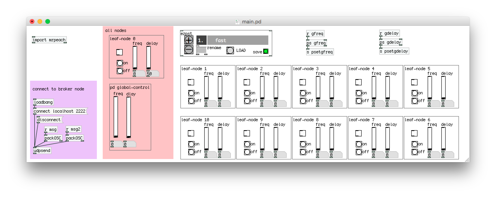

## GUI

You will need PureData's **pd-extended** to run this GUI.

Once you have **pd-extended**, start it up, go to `File > Open...` and select the file in this directory named `main.pd`. Ignore all the other files, they are only there to serve as support for `main.pd`.

The GUI will attempt to make a network connection upon start up, so that it can send commands to. Look in PD's main message window and make sure that this connection was successful.

##### Changing that network connection to another IP/port.
On the bottom left of the window you will see a purple section with a few boxes connected. One of the boxes says `connect localhost 2222`.

To change the *host* and *port* in the puredata sketch, press [Ctrl]+[e] to enter PureData's edit mode, click on the box that says `connect localhost 2222` and edit the values there, the first word must always be connect. When ready, press [Ctrl]+[e] again to exit *edit mode*, and click that box to perform the actual conection.
